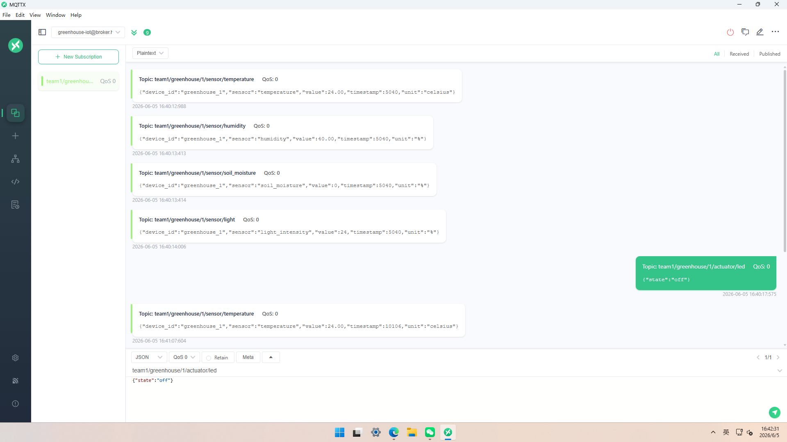

# 智慧农业大棚环境调控系统

## 实验背景

智慧农业大棚环境调控系统旨在解决传统农业中数据采集滞后、调控粗放、人力成本高及缺乏预警等痛点。本实验基于物联网四层架构（感知层 $`\to`$ 网络传输层 $`\to`$ 平台层 $`\to`$ 应用层），使用 Wokwi 仿真平台完成设备端开发，实现传感器数据采集、执行器控制以及通过 MQTT 协议将数据上传至云端，并响应云端下发指令。

### 目标

- 在 Wokwi 仿真环境中连接至少 2 种传感器（实际使用 DHT22 温湿度传感器、土壤湿度模拟传感器、光敏电阻光照传感器）和 1 个执行器（LED）。
- 通过 MQTT 协议连接到公共 Broker（HiveMQ），按照规范的主题命名发布传感器数据。
- 订阅控制主题，实现远程控制执行器（LED 模拟水泵/风扇）。
- 使用 JSON 格式封装数据，包含设备 ID、时间戳、数值等字段。
- 通过串口打印调试信息，验证通信流程。

### 环境

- **仿真平台**：[Wokwi 网页版](https://wokwi.com)
- **MQTT客户端**：MQTTX
- **代码编辑器**：Arduino IDE 风格，Wokwi 在线编译运行

## 系统设计方案

### 物联网四层架构

本实验沿用经典四层架构，具体映射如下：

| 层级 | 实现 |
|------|------|
| **感知层** | DHT22（温湿度）、电位器模拟 YL-69 土壤湿度、光敏电阻（光照强度）；执行器为 LED（模拟水泵/风扇继电器） |
| **网络传输层** | ESP32 通过 WiFi 连接互联网，使用 MQTT 协议与云端 Broker 通信 |
| **平台层** | HiveMQ 公共 Broker（broker.hivemq.com:1883）接收数据；Node-RED（后续实验）用于解析、存储与展示 |
| **应用层** | 农户通过 MQTTX 订阅数据并下发控制指令 |

### 传感器选型与理由

依据前期决策矩阵，本次实验选用以下传感器（均在 Wokwi 中可完整仿真）：

| 传感器 | 测量参数 | 选型理由 |
|--------|----------|----------|
| DHT22 | 温度（$`\pm 0.5^{\circ}C`$）、湿度（$`\pm 2\% RH`$） | Wokwi 原生支持，精度满足农业环境（0 ~ $`50^{\circ}C`$），成本低 |
| 电位器（模拟 YL-69） | 土壤湿度（0 ~ 100% 模拟量） | 直接反映土壤含水量，是自动灌溉核心依据；Wokwi 中用电位器完美仿真 |
| 光敏电阻（LDR） | 相对光照强度 | Wokwi 直接支持，判断光照强弱用于遮阳或补光决策 |

执行器使用 LED（GPIO2）模拟水泵/风扇的继电器开关。

### MQTT 主题命名规范

遵循层级化、语义清晰的命名规则，预留多棚扩展能力：

| 类型 | 主题示例 | 说明 |
|------|----------|------|
| 温度上报 | `team1/greenhouse/1/sensor/temperature` | 1 号棚空气温度 |
| 湿度上报 | `team1/greenhouse/1/sensor/humidity` | 1 号棚空气湿度 |
| 土壤湿度上报 | `team1/greenhouse/1/sensor/soil_moisture` | 1 号棚土壤湿度 |
| 光照上报 | `team1/greenhouse/1/sensor/light` | 1 号棚光照强度 |
| 控制指令 | `team1/greenhouse/1/actuator/led` | 控制 LED（水泵/风扇） |
| 状态反馈 | `team1/greenhouse/1/status/led` | LED 当前状态回传 |

### 数据格式

每条 JSON 消息包含设备 ID、传感器类型、数值、毫秒时间戳。示例：
```json
{
    "device_id":"greenhouse_1",
    "sensor":"temperature",
    "value":24.00,
    "timestamp":5040,
    "unit":"celsius"
}
```
控制指令格式支持简洁字符串（`"on"` 或 `"off"`）或完整JSON（`{"state":"on"}`），代码中做了兼容解析。

## 硬件连接与电路设计

### Wokwi 电路

根据 `diagram.json`，核心连接如下：

| 组件 | 引脚 | ESP32引脚 |
|------|------|-----------|
| DHT22 | SDA | GPIO4 |
| DHT22 | VCC | 3.3V |
| DHT22 | GND | GND |
| 电位器（土壤） | SIG | GPIO34 (ADC) |
| 光敏电阻 | AO | GPIO35 (ADC) |
| LED | 阳极（通过 220Ω 电阻） | GPIO2 |
| LED | 阴极 | GND |

具体电路图：


### 引脚分配说明

- **GPIO4**：单总线连接 DHT22。
- **GPIO34、GPIO35**：ADC 输入，分别读取土壤湿度和光照强度的模拟电压。
- **GPIO2**：数字输出，控制 LED（执行器）。
- 使用 `analogReadResolution(12)` 将 ADC 分辨率设为 12 位（0-4095）。

## 核心代码（`sketch.ino`）
```cpp
#include <WiFi.h>
#include <PubSubClient.h>
#include <DHT.h>

// 引脚定义
#define DHTPIN 4
#define DHTTYPE DHT22
#define SOIL_PIN 34 // 土壤湿度传感器（电位器）
#define LIGHT_PIN 35 // 光敏电阻
#define LED_PIN 2 // 执行器

DHT dht(DHTPIN, DHTTYPE);

// WiFi配置（Wokwi专用）
const char* ssid = "Wokwi-GUEST";
const char* password = "";

// MQTT配置
const char* mqtt_broker = "broker.hivemq.com";
const int mqtt_port = 1883;
const char* client_id = "esp32_greenhouse_1";

// 主题（按照设计文档）
const char* topic_temp = "team1/greenhouse/1/sensor/temperature";
const char* topic_humid = "team1/greenhouse/1/sensor/humidity";
const char* topic_soil = "team1/greenhouse/1/sensor/soil_moisture";
const char* topic_light = "team1/greenhouse/1/sensor/light";
const char* topic_actuator = "team1/greenhouse/1/actuator/led";

WiFiClient espClient;
PubSubClient mqttClient(espClient);

unsigned long lastPublishTime = 0;
const long publishInterval = 5000;

// 传感器读取函数
float readTemperature() {
  float t = dht.readTemperature();
  if (isnan(t)) return -1;
  return t;
}
float readHumidity() {
  float h = dht.readHumidity();
  if (isnan(h)) return -1;
  return h;
}
int readSoilMoisture() {
  int adc = analogRead(SOIL_PIN);
  return constrain(map(adc, 0, 4095, 0, 100), 0, 100);
}
int readLightIntensity() {
  int adc = analogRead(LIGHT_PIN);
  return constrain(map(adc, 0, 4095, 0, 100), 0, 100);
}

// 发布传感器数据（JSON格式）
void publishSensorData() {
  unsigned long now = millis();

  float temp = readTemperature();
  if (temp != -1) {
    String payload = "{\"device_id\":\"greenhouse_1\",\"sensor\":\"temperature\",\"value\":" + String(temp) + ",\"timestamp\":" + String(now) + ",\"unit\":\"celsius\"}";
    mqttClient.publish(topic_temp, payload.c_str());
    Serial.println("📤 温度: " + payload);
  }

  float hum = readHumidity();
  if (hum != -1) {
    String payload = "{\"device_id\":\"greenhouse_1\",\"sensor\":\"humidity\",\"value\":" + String(hum) + ",\"timestamp\":" + String(now) + ",\"unit\":\"%\"}";
    mqttClient.publish(topic_humid, payload.c_str());
    Serial.println("📤 湿度: " + payload);
  }

  int soil = readSoilMoisture();
  String soilPayload = "{\"device_id\":\"greenhouse_1\",\"sensor\":\"soil_moisture\",\"value\":" + String(soil) + ",\"timestamp\":" + String(now) + ",\"unit\":\"%\"}";
  mqttClient.publish(topic_soil, soilPayload.c_str());
  Serial.println("📤 土壤湿度: " + soilPayload);

  int light = readLightIntensity();
  String lightPayload = "{\"device_id\":\"greenhouse_1\",\"sensor\":\"light_intensity\",\"value\":" + String(light) + ",\"timestamp\":" + String(now) + ",\"unit\":\"%\"}";
  mqttClient.publish(topic_light, lightPayload.c_str());
  Serial.println("📤 光照强度: " + lightPayload);

  Serial.println("-------------------------------------");
}

// MQTT回调函数：处理远程控制指令
void mqttCallback(char* topic, byte* payload, unsigned int length) { // <--- 注意这个花括号
  String message;
  for (unsigned int i = 0; i < length; i++) message += (char)payload[i];
  Serial.print("📨 收到指令 [主题:" + String(topic) + "] 内容:" + message);

  if (String(topic) == topic_actuator) {
    String cmd = message;
    cmd.toLowerCase();
    bool ledState = false;
    if (cmd == "on" || cmd.indexOf("\"state\":\"on\"") != -1) ledState = true;
    else if (cmd == "off" || cmd.indexOf("\"state\":\"off\"") != -1) ledState = false;
    else return;

    digitalWrite(LED_PIN, ledState ? HIGH : LOW);
    Serial.println(ledState ? " 💡 LED点亮（水泵/风扇开启）" : " 💡 LED熄灭（水泵/风扇关闭）");

    // 发送状态反馈（符合设计文档的 status 主题）
    String feedbackTopic = "team1/greenhouse/1/status/led";
    String feedback = "{\"device_id\":\"greenhouse_1\",\"actuator\":\"led\",\"state\":" + String(ledState ? "\"on\"" : "\"off\"") + ",\"timestamp\":" + String(millis()) + "}";
    mqttClient.publish(feedbackTopic.c_str(), feedback.c_str());
    Serial.println("🔄 状态反馈已发送: " + feedback);
  }
}

// 连接WiFi
void connectWiFi() {
  Serial.print("📡 连接WiFi");
  WiFi.begin(ssid, password);
  while (WiFi.status() != WL_CONNECTED) { delay(500); Serial.print("."); }
  Serial.println("\n✅ WiFi已连接，IP:" + WiFi.localIP().toString());
}

// 连接MQTT
void connectMQTT() {
  while (!mqttClient.connected()) {
    Serial.print("🔌 连接HiveMQ...");
    if (mqttClient.connect(client_id)) {
      Serial.println("✅ 已连接");
      mqttClient.subscribe(topic_actuator);
      Serial.println("📡 已订阅控制主题: " + String(topic_actuator));
    } else {
      Serial.println("❌ 失败，5秒后重试");
      delay(5000);
    }
  }
}

void setup() {
  Serial.begin(115200);
  pinMode(LED_PIN, OUTPUT);
  digitalWrite(LED_PIN, LOW);
  dht.begin();
  analogReadResolution(12);

  Serial.println("\n🌱 智慧农业大棚系统 - 设备端启动");
  connectWiFi();
  mqttClient.setServer(mqtt_broker, mqtt_port);
  mqttClient.setCallback(mqttCallback);
  connectMQTT();
}

void loop() {
  if (!mqttClient.connected()) connectMQTT();
  mqttClient.loop();

  if (millis() - lastPublishTime >= publishInterval) {
    lastPublishTime = millis();
    publishSensorData();
  }
  delay(100);
}
```
## 实验过程

- 在 Wokwi 中创建项目，导入 `diagram.json` 和 `sketch.ino`。
- 添加 `libraries.txt` 列出的依赖：`DHT sensor library` 和 `PubSubClient`。
- 编译并启动仿真。
- 打开 MQTTX 客户端，连接到 `broker.hivemq.com:1883`。
- 订阅主题 `team1/greenhouse/1/sensor/#` 和 `team1/greenhouse/1/status/#`。
- 观察传感器数据上报。
- 在 MQTTX 中向 `team1/greenhouse/1/actuator/led` 发布 `{"state":"on"}` 或 `{"state":"off"}`，观察LED状态变化及反馈消息。

### Wokwi 输出
```
ets Jul 29 2019 12:21:46

rst:0x1 (POWERON_RESET),boot:0x13 (SPI_FAST_FLASH_BOOT)
configsip: 0, SPIWP:0xee
clk_drv:0x00,q_drv:0x00,d_drv:0x00,cs0_drv:0x00,hd_drv:0x00,wp_drv:0x00
mode:DIO, clock div:2
load:0x3fff0030,len:1156
load:0x40078000,len:11456
ho 0 tail 12 room 4
load:0x40080400,len:2972
entry 0x400805dc

🌱 智慧农业大棚系统 - 设备端启动
📡 连接WiFi.....
✅ WiFi已连接，IP:10.10.0.2
🔌 连接HiveMQ...✅ 已连接
📡 已订阅控制主题: team1/greenhouse/1/actuator/led
📤 温度: {"device_id":"greenhouse_1","sensor":"temperature","value":24.00,"timestamp":5040,"unit":"celsius"}
📤 湿度: {"device_id":"greenhouse_1","sensor":"humidity","value":40.00,"timestamp":5040,"unit":"%"}
📤 土壤湿度: {"device_id":"greenhouse_1","sensor":"soil_moisture","value":0,"timestamp":5040,"unit":"%"}
📤 光照强度: {"device_id":"greenhouse_1","sensor":"light_intensity","value":24,"timestamp":5040,"unit":"%"}
-------------------------------------
📨 收到指令 [主题:team1/greenhouse/1/actuator/led] 内容:{"state":"off"} 💡 LED熄灭（水泵/风扇关闭）
🔄 状态反馈已发送: {"device_id":"greenhouse_1","actuator":"led","state":"off","timestamp":5297}
🔌 连接HiveMQ...✅ 已连接
📡 已订阅控制主题: team1/greenhouse/1/actuator/led
📤 温度: {"device_id":"greenhouse_1","sensor":"temperature","value":24.00,"timestamp":10106,"unit":"celsius"}
📤 湿度: {"device_id":"greenhouse_1","sensor":"humidity","value":40.00,"timestamp":10106,"unit":"%"}
📤 土壤湿度: {"device_id":"greenhouse_1","sensor":"soil_moisture","value":0,"timestamp":10106,"unit":"%"}
📤 光照强度: {"device_id":"greenhouse_1","sensor":"light_intensity","value":24,"timestamp":10106,"unit":"%"}
-------------------------------------
```
### MQTT 客户端验证

- **订阅数据**：MQTTX 客户端成功接收温度（$`24.00^{\circ}C`$）、湿度（40.00%）、土壤湿度（0%）、光照（24%）等消息。
- **下发指令**：向 `team1/greenhouse/1/actuator/led` 发送 `{"state":"off"}`，设备端返回状态反馈。
- **时间戳验证**：消息均带有递增的时间戳，表明周期性上报正常工作。



## 实验总结

- ✅ 成功在 Wokwi 仿真环境中搭建了完整的设备端系统，实现了 DHT22、土壤湿度（电位器模拟）、光敏电阻三种传感器的数据采集。
- ✅ 使用 MQTT 协议连接到 HiveMQ 公共 Broker，按照规范主题发布JSON格式数据，周期性上报间隔5秒。
- ✅ 实现了远程控制执行器：从 MQTT 客户端发送指令控制 LED 开关，设备端正确响应并发送状态反馈。
- ✅ 串口调试信息完整，便于故障排查和教学演示。

### 问题及解决方案
| 问题 | 解决方案 |
|------|----------|
| DHT22 读取偶尔返回 NaN | 增加 `isnan()` 检查，跳过无效值，避免发布错误数据 |
| MQTT连接断开后无法自动重连 | 在 `loop()` 中增加 `if (!mqttClient.connected()) connectMQTT();` |
| 控制指令格式不统一 | 代码中同时支持纯文本 `"on"`或`"off"` 和JSON格式 `{"state":"on"}`，提高兼容性 |
| Wokwi 中 WiFi 连接需要特定 SSID | 使用 Wokwi 内置的 `Wokwi-GUEST`，无需密码 |

### 扩展性讨论

- **多棚扩展**：主题已预留 `greenhouse/1` 层级，只需修改 ID 即可接入多个大棚，Node-RED 可使用通配符 `team1/greenhouse/+/sensor/#` 一次性订阅所有数据。
- **真实硬件迁移**：代码中引脚定义与传感器逻辑与真实 ESP32 完全兼容，仅需修改 WiFi 凭据即可部署到实体设备。
- **执行器扩展**：当前使用 LED 模拟，实际可替换为继电器模块驱动水泵、风扇，代码逻辑无需改变。
- **平台层对接**：后续可连接 Node-RED 实现数据持久化（InfluxDB）、阈值告警和 Dashboard 可视化。

### 心得

通过本次实验，深入理解了物联网设备端开发的全流程：从传感器选型、电路连接、代码编写到 MQTT 云通信。 JSON 数据格式的设计保证了系统的可读性和扩展性；MQTT 主题的层级化命名使得多设备管理更加清晰。串口调试在仿真阶段发挥了关键作用，帮助快速定位连接问题和数据格式错误。本实验为后续实现完整的智慧农业监控与自动控制系统奠定了坚实基础。

## 提交清单

| 文件 | 说明 |
|------|------|
| `assets/diagram.png` | Woki 电路截图 |
| `assets/mqtt.png` | MQTT 客户端接收数据及发送指令截图 |
| `greenhouse/sketch.ino` | 完整 Arduino 代码，包含 WiFi、MQTT、传感器读取、控制回调 |
| `greenhouse/diagram.json` | Wokwi 电路连接配置 |
| `greenhouse/libraries.txt` | 依赖库列表（DHT sensor library、PubSubClient） |
| `greenhouse/wokwi-project.txt` | [Wokwi 项目链接](https://wokwi.com/projects/465970691544617985) |

## 协议与声明

本平台采用 **BSD 3‑Clause License**。在满足以下条件的前提下，允许自由使用、修改和分发：
- 保留原始版权声明、许可条款及免责声明。
- 禁止使用本项目的作者或贡献者名称进行商业推广或背书。