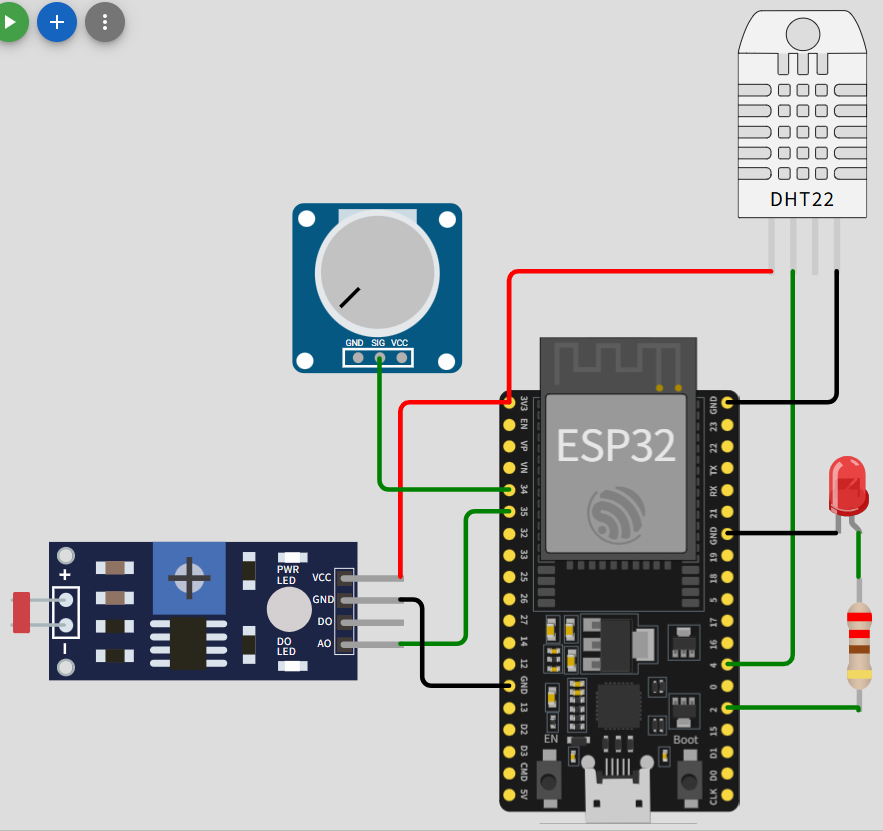
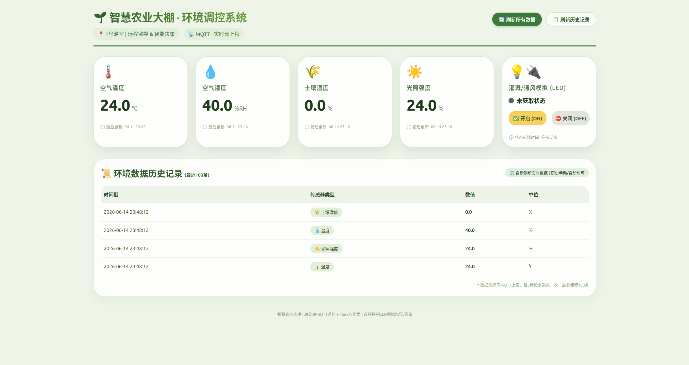

# 智慧农业大棚环境监控系统

[](https://www.python.org)
[](https://wokwi.com)
[](https://eclipse.dev/paho/)
[](https://flask.palletsprojects.com/en/stable/)
[](LICENSE)

## 📜 项目简介

本项目基于仿真环境（Wokwi + Python），严格遵循经典物联网四层架构（感知层、网络层、平台层、应用层），实现了一套 **全链路闭环** 的智慧农业大棚环境监控系统，解决传统农业中数据采集滞后、调控粗放、人力成本高等痛点，验证了端到端数据流和控制流的可靠性。

### 背景与痛点

传统农业大棚管理依赖人工经验，存在以下问题：

- **数据采集滞后**：温湿度、土壤水分等参数依靠定时巡查，无法实时获知异常变化。
- **调控粗放**：灌溉、通风等操作凭感觉，易导致作物生长效率低、水资源浪费。
- **人力成本高**：大规模大棚需要多人轮班监控，且夜间或恶劣天气时难以及时响应。
- **缺乏预警**：高温干旱或湿度过大引发病害时，往往发现已造成损失。

### 用户角色与核心诉求

| 角色 | 特征 | 核心诉求 |
|---|---|---|
| 农户/管理员 | 35 ~ 60岁，熟悉手机但不懂编程 | 远程查看环境数据、接收告警、减少人工巡检 |
| 技术运维 | 了解传感器基础知识 | 快速定位故障，查看历史趋势 |
| 农场主/投资者 | 关注投入产出比 | 系统稳定、易扩展至多个大棚 |

### 核心功能（MoSCoW 法）

| 优先级 | 功能 | 描述 |
|---|---|---|
| **必须有** | 环境数据采集 | 实时采集空气温湿度、土壤湿度、光照强度 |
| **必须有** | 数据上云 | 通过 MQTT 将传感器数据发送至云平台 |
| **必须有** | 远程查看 | Web 端展示当前环境数值及历史曲线 |
| **应该有** | 自动灌溉控制 | 阈值触发的自动控制（本版本预留接口） |
| **应该有** | 异常告警 | 温度过高/过低推送告警（可扩展 Node-RED） |
| **可以有** | 手动远程干预 | Web 页面手动开关灌溉、通风（已实现） |
| **可以有** | 多棚统一管理 | 通过主题层级预留扩展能力 |

### 传感器选型

| 传感器 | 选型理由 |
|--------|----------|
| **DHT22** | Wokwi 原生支持，精度 $`\pm 0.5^{\circ}C`$ / $`\pm 2 \% RH`$，满足农业环境监控需求 |
| **电位器模拟 YL-69** | 直接反映土壤含水量，是自动灌溉的核心依据，仿真成本极低 |
| **光敏电阻 (LDR)** | 判断光照强弱用于遮阳或补光决策，性价比高 |

## 📁 文件结构
```
homework-IoT/
├── .gitignore
├── LICENSE
├── README.md
├── server.py              # Flask 后端入口：内嵌 MQTT 客户端订阅传感器数据，提供 REST 接口：latest、history、control
├── assets/                # 静态资源目录：存放电路截图、前端展示图片、流程图等
├── templates/             # 前端界面
│   └── index.html         # 响应式农业看板，含传感器卡片、LED 执行器控制按钮、历史数据表格，通过 AJAX 轮询刷新
└── greenhouse/            # Wokwi 仿真工程目录（ESP32 设备端）
    ├── sketch.ino         # Arduino 主程序：DHT22、土壤、光照采集，MQTT 周期发布，回调处理远程控制指令（兼容纯文本/JSON）、LED 状态反馈
    ├── diagram.json       # Wokwi 电路连接配置：定义 ESP32 与 DHT22、电位器、光敏电阻、LED 的引脚映射与电气连接
    ├── libraries.txt      # Arduino 依赖库清单：DHT sensor library、PubSubClient（用于 MQTT 通信）
    └── wokwi-project.txt  # Wokwi 在线项目链接
```
## 🚀 快速开始

**启动设备端仿真**：打开 [Wokwi 项目](https://wokwi.com/projects/465970691544617985)，开始仿真，等待 ESP32 连接 WiFi 和 HiveMQ，观察串口输出确认数据上报。
```bash
git clone https://github.com/celestial-dew/homework-IoT.git
cd homework-IoT
python server.py
```
用户只需安装 [Python](https://www.python.org/downloads) 3.10 以上。（推荐用虚拟环境）运行时自动检测并配置 `flask`、`paho-mqtt` 等必需依赖。

在浏览器输入服务器（本机）域名，**打开前端界面**（测试阶段自动打开 [http://localhost:5000](http://localhost:5000)）

**功能验证**：点击 LED 卡片上的“开启”按钮，Wokwi 的红色 LED 点亮，历史表格自动追加新记录。

## 🔁 核心数据流

- 上行（设备 $`\to`$ 云端 $`\to`$ Web）

  ESP32 以 5 秒为周期采集传感器数据 $`\to`$ 构造 JSON 消息并通过 MQTT 发布至 HiveMQ Broker $`\to`$ Flask 后端内嵌 MQTT 客户端订阅通配符主题 `team1/greenhouse/1/sensor/#` 及 `status/led` $`\to`$ 在 `on_message` 回调中解析 JSON，将设备毫秒时间戳转换为本地时间字符串，更新 `latest` 字典与 `history` 双端队列（容量 100） $`\to`$ 前端每 3 秒通过 AJAX 轮询 `/api/latest` 获取最新数据并刷新卡片显示。

- 下行（Web $`\to`$ 云端 $`\to`$ 设备）

  用户点击前端按钮 $`\to`$ JavaScript 发送 POST 请求至 `/api/control`，携带 `{"state":"on"}` 或 `{"state":"off"}` $`\to`$ Flask 后端向 MQTT 主题 `team1/greenhouse/1/actuator/led` 发布指令 $`\to`$ ESP32 的 `mqttCallback` 函数接收指令，解析后控制 GPIO2 电平 $`\to`$ LED 执行相应动作 $`\to`$ 设备立即向 `team1/greenhouse/1/status/led` 主题发布状态反馈 JSON（含 `state` 与 `timestamp`） $`\to`$ Flask 后端更新 `latest["led"]` $`\to`$ 前端下次轮询时获取最新状态并更新执行器卡片。

## 🧠 MQTT 主题规范

| 类型 | 示例 | 说明 |
|---|---|---|
| 温度上报 | `team1/greenhouse/1/sensor/temperature` | 1号棚空气温度 |
| 湿度上报 | `team1/greenhouse/1/sensor/humidity` | 1号棚空气湿度 |
| 土壤湿度上报 | `team1/greenhouse/1/sensor/soil_moisture` | 1号棚土壤湿度 |
| 光照上报 | `team1/greenhouse/1/sensor/light` | 1号棚光照强度 |
| 控制指令 | `team1/greenhouse/1/actuator/led` | LED 开关 |
| 状态反馈 | `team1/greenhouse/1/status/led` | LED 当前状态回传 |

所有消息均使用 JSON 格式，包含 `device_id`、`timestamp`（毫秒）等字段。

## 📡 设备端开发

### 硬件连接（`diagram.json`）

| 组件 | 引脚 | ESP32 引脚 |
|---|---|---|
| DHT22 | SDA | GPIO4 |
| DHT22 | VCC | 3.3V |
| DHT22 | GND | GND |
| 电位器（土壤湿度） | SIG | GPIO34 (ADC) |
| 光敏电阻 | AO | GPIO35 (ADC) |
| LED 阳极（串联 220 $`\Omega`$） | 正极 | GPIO2 |
| LED 阴极 | 负极 | GND |

### 电路图



### 设备代码（`sketch.ino`）

#### 头文件与引脚定义
```cpp
#include <WiFi.h>
#include <PubSubClient.h>
#include <DHT.h>

#define DHTPIN 4
#define DHTTYPE DHT22
#define SOIL_PIN 34
#define LIGHT_PIN 35
#define LED_PIN 2
```
`PubSubClient` 是 Arduino 生态中最常用的 MQTT 客户端库，支持非阻塞的 loop() 调用。

ADC 引脚 34、35 为纯输入引脚，无内部上拉，适合模拟传感器。

#### WiFi 与 MQTT 配置
```cpp
const char* ssid = "Wokwi-GUEST";
const char* mqtt_broker = "broker.hivemq.com";
const int mqtt_port = 1883;
const char* client_id = "esp32_greenhouse_1";

// 主题定义（遵循层级化规范，便于多棚扩展）
const char* topic_temp = "team1/greenhouse/1/sensor/temperature";
const char* topic_humid = "team1/greenhouse/1/sensor/humidity";
const char* topic_soil = "team1/greenhouse/1/sensor/soil_moisture";
const char* topic_light = "team1/greenhouse/1/sensor/light";
const char* topic_actuator = "team1/greenhouse/1/actuator/led";
```
Wokwi 仿真环境使用专用 SSID Wokwi-GUEST，无需密码，自动分配 IP。

客户端 ID 需全局唯一，此处使用固定字符串，生产环境建议加入 MAC 后缀。

#### 传感器读取（含无效数据过滤）
```cpp
float readTemperature() {
  float t = dht.readTemperature();
  if (isnan(t)) return -1;   // 跳过无效数据
  return t;
}

int readSoilMoisture() {
  int adc = analogRead(SOIL_PIN);
  return constrain(map(adc, 0, 4095, 0, 100), 0, 100);
}
```
DHT22 偶尔会返回 NaN，如传感器未就绪或通信干扰；通过 `isnan` 检查避免发布错误数据。

土壤湿度和光照强度均将 ADC 值（12 位分辨率，0 ~ 4095）线性映射到 0 ~ 100%，便于前端理解。

#### MQTT 回调（远程控制核心）
```cpp
void mqttCallback(char* topic, byte* payload, unsigned int length) {
  String message;
  for (unsigned int i = 0; i < length; i++) message += (char)payload[i];

  if (String(topic) == topic_actuator) {
    String cmd = message;
    cmd.toLowerCase();
    bool ledState = false;
    // 兼容纯文本 "on"/"off" 和 JSON {"state":"on"}
    if (cmd == "on" || cmd.indexOf("\"state\":\"on\"") != -1) ledState = true;
    else if (cmd == "off" || cmd.indexOf("\"state\":\"off\"") != -1) ledState = false;
    else return;

    digitalWrite(LED_PIN, ledState ? HIGH : LOW);
    // 发送状态反馈到 status/led 主题
    String feedbackTopic = "team1/greenhouse/1/status/led";
    String feedback = "{\"device_id\":\"greenhouse_1\",\"actuator\":\"led\",\"state\":" + String(ledState ? "\"on\"" : "\"off\"") + ",\"timestamp\":" + String(millis()) + "}";
    mqttClient.publish(feedbackTopic.c_str(), feedback.c_str());
  }
}
```
该函数设计为 **兼容两种指令格式**：用户可通过 MQTT 客户端直接发送 `"on"` 字符串，或发送标准 JSON（如 `{"state":"on"}`），增强了系统的通用性。

执行动作后立即发布状态反馈，实现“命令 - 确认”闭环，确保后端能够同步执行器真实状态。

#### 主循环（自动重连 + 周期性发布）
```cpp
void loop() {
  if (!mqttClient.connected()) connectMQTT();
  mqttClient.loop();
  if (millis() - lastPublishTime >= 5000) {
    lastPublishTime = millis();
    publishSensorData();
  }
  delay(100);
}
```
每次 `loop()` 都检查 MQTT 连接状态，若断开则调用 `connectMQTT()` 重连，保证了长时间运行的稳定性。

`mqttClient.loop()` 负责处理 MQTT 消息收发和 Keep-Alive 心跳。

非阻塞延时 `delay(100)` 避免过度占用 CPU，同时保证了轮询精度。

## 🌐 应用层开发

### 后端架构（`server.py`）

#### 自定义 MQTT 客户端类 `greenhouse`
```python
class greenhouse(mqtt.Client):
    def __init__(self):
        self.begin = time.time()
        self.latest = {}
        self.history = deque(maxlen=100)
        super().__init__(mqtt.CallbackAPIVersion.VERSION2, str(self.begin))
        super().connect("broker.hivemq.com")

    def on_connect(self, client, userdata, flags, reason_code, properties=None):
        super().subscribe("team1/greenhouse/1/sensor/#")
        super().subscribe("team1/greenhouse/1/status/led")

    def on_message(self, client, userdata, msg: mqtt.MQTTMessage):
        payload = json.loads(msg.payload.decode())
        payload["timestamp"] = time.strftime(
            "%Y-%m-%d %H:%M:%S",
            time.localtime(self.begin + payload["timestamp"] / 1e3)
        )  # 将设备毫秒时间戳转换为本地时间字符串
        sensor = os.path.basename(msg.topic)   # 例如 "temperature"
        self.latest[sensor] = payload
        if "value" in payload:                 # 只有传感器数据存入历史队列
            self.history.append(payload)
```
`deque(maxlen=100)` 自动维护最近 100 条记录，无需手动删除旧数据。

时间戳转换：设备端上报 `millis()` 启动偏移量，后端利用 `self.begin` 记录服务启动时间，计算出绝对时间，并格式化为人类可读的字符串。

使用 `os.path.basename(msg.topic)` 提取主题最后一段作为 key，例如 `team1/greenhouse/1/sensor/temperature` $`\to`$ `temperature`，使得 latest 字典结构清晰。

#### Flask 路由
```python
@app.route("/")
def index():
    return fl.render_template("index.html")

@app.route("/api/latest")
def latest():
    return fl.jsonify(client.latest)

@app.route("/api/history")
def history():
    return fl.jsonify(list(client.history)[::-1])   # 倒序，最新记录在前

@app.route("/api/control", methods=["POST"])
def control():
    payload = json.dumps({"state": fl.request.get_json()["state"]})
    rc = client.publish(topic_actuator, payload)
    if mqtt.MQTT_ERR_SUCCESS == rc.rc:
        return fl.jsonify({"status": "ok", "msg": payload})
    return fl.jsonify({"status": "error"}), 500
```
`/api/history` 返回倒序列表，前端表格展示时无需再排序。

控制接口发布 MQTT 指令后检查返回码，成功则返回 200，否则返回 500，便于前端错误处理。

#### 并发运行
```python
if __name__ == "__main__":
    Thread(target=app.run, args=("0.0.0.0", 5000, False), daemon=True).start()
    client.loop_forever()
```
Flask 开发服务器默认阻塞主线程，此处使用守护线程启动，主线程运行 MQTT 消息循环，两者互不干扰。

若需生产部署，可改用 `waitress` 或 `gunicorn`，但本实验环境使用内置服务器足够。

### 🎨 前端界面（`index.html`）

#### 实时数据轮询
```javascript
const POLL_INTERVAL = 3000;
setInterval(() => fetchLatestData(), POLL_INTERVAL);

async function fetchLatestData() {
    const response = await fetch("/api/latest");
    const data = await response.json();
    updateSensorCards(data);
}
```
每 3 秒请求一次最新数据，兼顾实时性与服务器负载。

`updateSensorCards` 函数根据返回的 JSON 动态更新四个传感器卡片和一个执行器卡片的数值、单位、时间戳及 LED 状态灯。

#### 远程控制
```javascript
async function sendLedControl(state) {
    const response = await fetch("/api/control", {
        method: "POST",
        headers: { "Content-Type": "application/json" },
        body: JSON.stringify({ state: state })
    });
    const result = await response.json();
    if (response.ok) {
        showToast(`✅ 指令已发送: LED ${state === "on" ? "开启" : "关闭"}`);
        setTimeout(() => fetchLatestData(), 600); // 等待设备反馈后刷新状态
    } else {
        showToast(`❌ 控制失败: ${result.msg || "未知错误"}`, true);
    }
}
```
使用 `fetch` 发送异步 POST 请求，不刷新页面。

发送成功后延迟 600ms 主动拉取最新数据，以便快速获取设备返回的状态反馈，提升用户体验。

#### 历史表格渲染
```javascript
async function fetchHistoryData() {
    const response = await fetch("/api/history");
    const records = await response.json();
    renderHistoryTable(records);
}
setInterval(() => fetchHistoryData(), 25000);

function renderHistoryTable(records) {
    let html = "";
    for (const item of records) {
        let displaySensor = sensorNameMap[item.sensor] || item.sensor;
        let valueDisplay = item.value?.toFixed(1) ?? "--";
        html += `<tr><td>${escapeHtml(item.timestamp)}</td><td>${escapeHtml(displaySensor)}</td><td><strong>${valueDisplay}</strong></td><td>${escapeHtml(item.unit)}</td></tr>`;
    }
    tbody.innerHTML = html;
}
```
历史表格独立于实时卡片，每 25 秒刷新一次，避免频繁 DOM 操作。

使用 `sensorNameMap` 将传感器英文标识映射为中文图标+名称，提高可读性。

对数值保留一位小数，并对所有输出进行 `escapeHtml` 防 XSS 处理。

#### 页面预览



## 🔮 扩展方向

- **数据持久化**：用 InfluxDB 或 SQLite 替代内存队列，支持长期存储和趋势分析。
- **自动阈值控制**：在 Flask 后端增加规则引擎，土壤湿度低于阈值时自动发布开启指令。
- **告警推送**：通过钉钉机器人、微信或邮件推送高温、低温、干旱等告警。
- **多棚支持**：利用主题通配符 `team1/greenhouse/+/sensor/#` 接入多个大棚。
- **AI 辅助决策**：基于历史数据训练简单模型，推荐灌溉/通风策略。
- **真实硬件部署**：将代码烧录到实体 ESP32，连接真实传感器和继电器。

## ⚖️ 协议与声明

本平台采用 **BSD 3‑Clause License**。在满足以下条件的前提下，允许自由使用、修改和分发：
- 保留原始版权声明、许可条款及免责声明。
- 禁止使用本项目的作者或贡献者名称进行商业推广或背书。